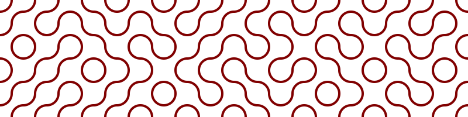
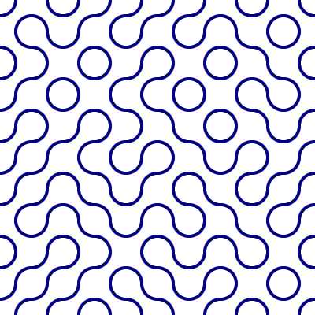

# truchet

`truchet.py` is a simple script for generating Smith-type Truchet tiles, like this:



## Setup

The script needs 2 libraries which can be installed by running `sudo pip3 install drawSvg argparse`.

## Arguments

Just run `python3 truchet.py` to run the script. All arguments are optional.

By default this image will be generated:



The script is self documenting and takes these options:
```
python3 truchet.py --help

usage: truchet.py [-h] [--width WIDTH] [--height HEIGHT] [--tile TILE]
                  [--stroke STROKE] [--color COLOR] [--seed SEED] [--squares]
                  [--output OUTPUT]

Generate svg of random truchet tiles.

optional arguments:
  -h, --help       show this help message and exit
  --width WIDTH    Width of svg in tiles. (default: 10)
  --height HEIGHT  Height of svg in tiles. (default: 10)
  --tile TILE      Size of tile in px. (default: 40)
  --stroke STROKE  Stroke width of arcs. (default: 4)
  --color COLOR    Color of arcs. HTML colors are valid and should be
                   **quoted**. Eg: "#800000", "rgb(0,255,0)", "blue" (default:
                   navy)
  --seed SEED      Seed value for PRNG. (default: 42)
  --squares        Add tile boundaries, stroke=1/color="silver" (default:
                   False)
  --output OUTPUT  Output filename (default: truchet.svg)
```
